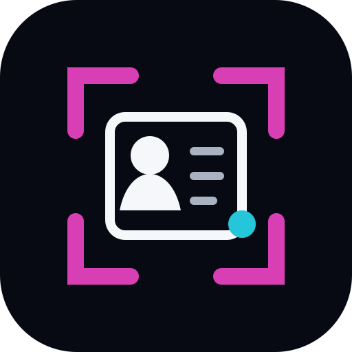

<p align="center">
  
</p>

<h1 align="center">ScanRecall</h1>

<p align="center">
  <strong>Scan. Remember. Follow up.</strong><br>
  Privacy-first business-card and event-contact capture for Android.<br>
  <strong>by <a href="https://arivemb.com/">ArivEmb</a></strong>
</p>

---

## Current test build

This branch contains the **ScanRecall v0.3 beta**.

The current Android test build is **v0.3.0-beta.4**.

- Release: https://github.com/Madhan-Kurukondar/card-keep/releases/tag/v0.3.0-beta.4
- APK: https://github.com/Madhan-Kurukondar/card-keep/releases/download/v0.3.0-beta.4/ScanRecall-Android-v0.3.0-beta.4.apk
- Android package: `com.madhankurukondar.scanrecall.beta`
- Minimum Android version: Android 10 / API 29
- The beta can be installed alongside the stable CardKeep v0.2.1 app.

**ScanRecall is beta software. OCR output and automatically classified contact fields must be reviewed before relying on them.**

---

## What ScanRecall is

ScanRecall is designed for people who collect many business cards and event contacts and do not want the useful context around those meetings to disappear.

It combines:

- business-card or badge OCR
- QR / barcode data when available
- event and conference context
- discussion notes
- opportunity / relevance notes
- next actions and follow-up information

into one editable local contact record.

The emphasis is on **fast capture, local processing and recoverability** rather than pretending OCR is always perfect.

---

## Available now — v0.3.0-beta.4

### Business-card and badge capture

- Scan one business card or badge with the Android camera.
- Import one image from the device.
- Add a contact manually.
- Review and edit all detected fields before saving.
- The original card/badge image is retained in ScanRecall's private app storage with the record.

### Offline OCR

ScanRecall currently uses on-device ML Kit **Latin-script text recognition**.

The OCR pipeline uses two passes:

1. the original image
2. a colour-robust processed image intended to improve recognition of coloured headings, names and small punctuation

Text detected by the two passes is combined. Exact duplicate lines are removed while differing readings are retained.

The parser attempts to identify:

- name
- company
- job title
- email
- work / mobile phone
- website
- address

The complete OCR transcript is also retained instead of being discarded.

### Raw OCR fallback

For every scanned record, ScanRecall keeps the OCR source text so that a user can inspect what the OCR engine actually read.

The raw OCR transcript is:

- visible inside the ScanRecall contact record
- stored with the local ScanRecall record
- appended to **Android Contacts > Notes** when saving to phone contacts
- included in exported vCards

This is deliberate. If automatic field classification is wrong, the original OCR reading remains available for manual recovery.

### Smart QR / barcode handling

The same captured image is also checked for QR / barcode data.

Structured payloads currently handled include:

- **vCard QR** — contact fields are extracted
- **MECARD QR** — contact fields are extracted
- **mailto:** — email is extracted
- **tel:** — telephone number is extracted
- **LinkedIn / profile / website URL** — URL is retained
- **opaque event badge identifier** — retained as context rather than treated as personal data

ScanRecall does **not** attempt to decrypt or bypass proprietary event-platform QR systems.

### Conference / trade-fair mode

Conference Mode is available.

Create an event once, for example:

**Embedded World 2027 · Nuremberg**

New contacts scanned inside that conference can automatically inherit:

- event name
- event location
- scan date
- default "how we met" text
- default tags

Contacts remain grouped under the conference.

The conference view provides **Scan Next Person** for rapid scanning.

### Rapid scanning workflow

Both main save paths protect the ScanRecall record before moving on:

**Save in ScanRecall**

- stores the record locally
- returns to the conference or home screen
- makes the next scan immediately available

**Save to Phone Contacts**

- first saves the record locally in ScanRecall
- opens Android's normal contact-save screen
- when that screen closes, returns to the conference or home screen instead of leaving the previous contact editor open
- the ScanRecall copy therefore remains available even if the Android contact-save operation is cancelled

### Contact and follow-up context

A ScanRecall record can contain:

- name and company
- title
- phone / mobile
- email
- website
- postal address
- event / where met
- date and location
- how you met
- relevance
- discussion
- opportunity
- next action
- follow-up
- status
- priority
- tags
- general notes
- raw OCR source

### Local contact management

- local contact list
- conference-specific contact lists
- search across relevant contact/context fields
- edit existing records
- delete records
- delete the privately stored card image together with the record

### Android Contacts integration

ScanRecall can open Android's native contact-create screen with detected and edited data prefilled.

Where supported by the Android contact application, ScanRecall supplies:

- name
- company
- job title
- email
- phone numbers
- address
- website
- meeting/context notes
- raw OCR transcript

### vCard export

A contact can be exported as an individual **.vcf / vCard 3.0** file.

Context notes and the raw OCR transcript are included in the vCard notes.

### Privacy

ScanRecall is intentionally local-first.

- no ScanRecall account
- no ads
- no analytics
- no ScanRecall cloud backend
- no Android Internet permission
- no network-state permission
- OCR runs on the device
- QR / barcode recognition runs on the device
- records and card images remain on the device unless the user explicitly exports or saves data elsewhere

---

## Feature status / roadmap

| Feature | Status in v0.3.0-beta.4 |
| --- | --- |
| Conference / trade-fair rapid scanning mode | **Available** |
| Improved OCR parsing | **Available and still being refined** |
| Colour-robust OCR pass | **Available** |
| Raw OCR retained in ScanRecall | **Available** |
| Raw OCR copied to Android contact notes | **Available** |
| QR / barcode + visible-text Smart Scan | **Available** |
| Android Contacts integration | **Available** |
| Individual vCard export | **Available** |
| Duplicate detection | **Not available yet** |
| Contact merging | **Not available yet** |
| Front + back card scanning / merging | **Not available yet** |
| Bulk image processing | **Not available yet** |
| CSV export | **Not available yet** |
| Backup / restore | **Not available yet** |
| Optional voice notes | **Not available yet** |
| iOS version | **Not available yet** |

---

# Known limitations

This section is intentional. ScanRecall should make its failure modes clear rather than hide them.

## 1. OCR is not ground truth

OCR can misread, omit or merge characters.

Common causes include:

- motion blur
- poor focus
- glare or reflections
- very small text
- low contrast
- unusual fonts
- textured or patterned cards
- text crossing graphics
- heavily stylised typography
- perspective distortion
- damaged cards

Always review important fields before saving or using them.

The retained OCR transcript is a fallback record, but it can itself contain OCR errors.

## 2. Coloured text is supported, but not guaranteed

ScanRecall performs a second colour-robust OCR pass and has successfully handled cards where names or headings use different colours.

However, colour processing cannot guarantee recognition.

Recognition can still fail when:

- the text colour is too close to the background colour
- the card uses gradients
- there is strong glare
- metallic / reflective print is used
- text is extremely small
- a coloured background reduces contrast
- decorative graphics overlap the text

The app does not infer missing text that neither OCR pass detected.

## 3. Names split across multiple lines are a known limitation

The current name parser expects a typical person's name to appear primarily on **one OCR line**, normally as roughly two to five words.

For example, this layout is currently a difficult case:

```text
John
Smith
```

ScanRecall deliberately does **not** automatically join arbitrary neighbouring one-word lines because that could create false names from layouts such as:

```text
Product
Manager
```

or:

```text
Texas
Instruments
```

The full OCR transcript remains available for manual correction.

## 4. Unusual card layouts can confuse field classification

OCR recognition and field classification are separate problems.

The OCR engine may correctly read all text while ScanRecall still assigns a line to the wrong field.

Possible cases include:

- company name interpreted as a person's name
- department interpreted as a title
- title interpreted as company text
- address fragments interpreted incorrectly
- multiple phone numbers assigned to the wrong phone type
- multiple email addresses where the wrong one is selected as primary

All extracted fields remain editable.

## 5. Email punctuation cannot be reconstructed if OCR never saw it

ScanRecall normalises several OCR representations of hyphens and can repair spacing around characters such as:

- `-`
- `.`
- `_`
- `+`
- `@`

But if OCR completely omits a character, ScanRecall does not invent it.

For example, if the printed address is:

```text
a-madwesh@example.com
```

but OCR returns:

```text
amadwesh@example.com
```

ScanRecall cannot safely know whether the missing character was a hyphen, period, underscore or nothing.

## 6. Current OCR model is Latin-script focused

The current build uses ML Kit's Latin text recognizer.

Latin-script languages and accented Latin characters are the intended target.

Cards primarily using scripts such as Chinese, Japanese, Korean, Arabic, Cyrillic or Devanagari are **not currently a supported OCR target** and should not be expected to work reliably.

## 7. Parser vocabulary is not universal

Job-title and company detection currently use heuristic rules and a limited vocabulary.

Uncommon titles, abbreviations, non-English wording and unusual company naming can reduce classification accuracy.

The parser is deliberately conservative rather than attempting aggressive guesses.

## 8. Address parsing is basic

Address extraction is heuristic-based and currently relies heavily on:

- digits
- common street/address terms
- a limited number of address lines

International or unusual address formats can be incomplete or incorrectly classified.

## 9. Phone-number type detection is heuristic

If the card clearly labels a number as mobile/cell, ScanRecall attempts to use that information.

If labels are ambiguous or several numbers are present, the selected work/mobile assignment may be wrong.

## 10. One person / one card image per scan

ScanRecall currently assumes that one imported or photographed image represents one person's card or badge.

It does **not** segment multiple business cards from a single photograph.

If several cards are present in one image, their OCR text may be mixed into a single record.

## 11. Front + back scanning is not implemented

There is currently no workflow that links the front and back of one physical card into a single scan.

A second image is treated as a separate scan.

## 12. No automatic card-edge detection or perspective correction

ScanRecall currently processes the captured image rather than running a dedicated document-scanner pipeline.

Good framing, focus and lighting therefore matter.

## 13. Proprietary event QR codes may contain no contact information

Many trade fairs encode only an attendee ID, token or platform-specific identifier.

ScanRecall can preserve that identifier, but it cannot obtain personal data that is not actually present in the QR payload.

It does not attempt to bypass event-platform access controls.

## 14. Android Contacts behaviour varies by device

ScanRecall opens Android's native contact-create flow rather than silently writing directly into the user's address book.

Different Android manufacturers and contact applications can:

- display fields differently
- ignore unsupported fields
- alter phone-number labels
- handle websites differently
- truncate or display long notes differently

ScanRecall cannot reliably determine whether the user pressed **Save** or **Cancel** in every third-party contact application.

For that reason, the ScanRecall record is stored locally **before** the Android Contacts screen opens.

## 15. No duplicate detection or merge protection

Scanning the same person twice currently creates two ScanRecall records unless the user manually removes one.

Saving both to Android Contacts can also create duplicate phone contacts.

Automatic matching and merging are planned but not implemented.

## 16. No bulk processing

Images are currently processed one at a time.

There is no:

- multi-select gallery import
- folder import
- batch queue
- PDF business-card import

## 17. Export is currently per-contact vCard only

CSV export is not implemented.

There is no current one-click export of the complete ScanRecall database.

## 18. No backup / restore yet

ScanRecall's local database and privately stored card images are app-local data.

The Android manifest currently disables Android application backup.

Therefore:

- uninstalling ScanRecall can remove the local ScanRecall database and images
- clearing the app's storage can remove them
- reinstalling the APK does not constitute a backup/restore mechanism

Contacts already saved into the phone's Contacts database and vCard files exported elsewhere are separate from ScanRecall's local data.

A dedicated backup / restore format is planned.

## 19. No voice notes

Meeting notes are currently text-only.

Audio capture, transcription and attachment of voice notes are not implemented.

## 20. Android only

There is currently no iOS build.

## 21. Beta scale has not been formally benchmarked

The current storage design is suitable for normal testing and conference use, but ScanRecall has not yet been benchmarked as a large CRM or for tens of thousands of records.

---

## What ScanRecall deliberately does not do

ScanRecall currently does not:

- upload cards to a cloud OCR service
- use an online LLM to "guess" missing contact information
- infer characters that OCR did not actually detect
- decrypt proprietary badge systems
- silently write contacts without showing Android's contact-save flow
- claim that OCR-derived contact data is always correct

The design preference is **recoverable data over confident-looking guesses**.

---

## Data safety during scanning

When **Save to Phone Contacts** is selected, ScanRecall first stores its own local record and only then opens Android Contacts.

This prevents the scanned card from being lost if:

- the Android contact screen is cancelled
- the Contacts app is closed
- the user returns without saving the phone contact

The local ScanRecall copy remains available.

---

## Product identity

The visible product name is **ScanRecall**.

The v0.3 beta uses the separate Android package:

`com.madhankurukondar.scanrecall.beta`

This allows ScanRecall Beta and CardKeep v0.2.1 to remain installed side-by-side.

ScanRecall uses its own launcher icon and the ArivEmb visual palette.

**ScanRecall**  
*by ArivEmb*

---

## Open source

Licensed under the **Apache License 2.0**.

You may use, fork, modify and redistribute the project under the licence terms. Contributions can be proposed through pull requests; public visibility does not grant write access to the repository.

---

## Stable release

Until ScanRecall testing is complete, the existing stable build remains:

**CardKeep v0.2.1**

The ScanRecall beta is intentionally developed on the separate branch:

`scanrecall-v0.3`

---

<p align="center">
  <strong>ScanRecall</strong><br>
  Remember the people you meet.<br>
  by <a href="https://arivemb.com/">ArivEmb</a>
</p>
